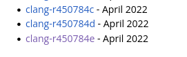
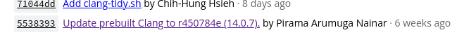
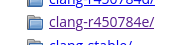
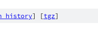

# Cherry Kernel for Redmi7A (mi439)

## Prepare world
1. Open and find "Prebuilt Versions" in bottom of page: https://android.googlesource.com/platform/prebuilts/clang/host/linux-x86/+/master/README.md
2. Follow the link with the text "clang-r*"

	

3. Open latest commit

	

4. Find the required version among the folders

	

5. Download tgz file

	

6. Unpack archive: `$ tar xvf clang-*.tgz`
7. Set PATH: `$ export PATH="$PATH:/path/to/clang/bin"`
8. Use package manager to download aarch64-linux-gnu binaries

	`# pacman -S aarch64-linux-gnu-gcc`

## Compiling
```
$ git clone https://github.com/rustzz/XiaomiRedmi7A-Kernel-ARM64
$ cd XiaomiRedmi7A-Kernel-ARM64/
```

```
$ make O=out \
	CC=clang CROSS_COMPILE=aarch64-linux-gnu- \
	ARCH=arm64 SUBARCH=arm64 \
	CLANG_TRIPLE=aarch64-linux-gnu- cherry-mi439_defconfig
$ make O=out \
	CC=clang CROSS_COMPILE=aarch64-linux-gnu- \
	ARCH=arm64 SUBARCH=arm64 \
	CLANG_TRIPLE=aarch64-linux-gnu- -j$(nproc)
```

## Creating flashable zip
```
$ cp out/arch/arm64/boot/dtbo.img AnyKernel3/
$ cp out/arch/arm64/boot/Image.gz-dtb AnyKernel3/
$ cd AnyKernel3/
$ mkdir /tmp/output
$ export fileName="/tmp/output/Kernel_$(date +%Y%m%d-%H%M).zip"
$ 7z a -mm=Deflate -mfb=258 -mpass=15 -r $fileName *
```


